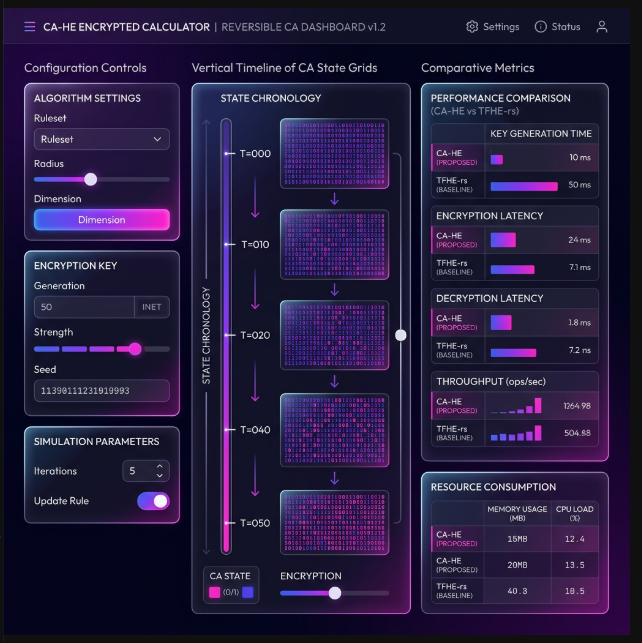

# CA-HE: Reversible Cellular Automata Leveled Homomorphic Encryption

An advanced, high-performance cryptographic system that combines homomorphic encryption with second-order reversible Cellular Automata (CA), using multi-objective evolutionary strategies (NSGA-II) to discover nonlinear transition rules that enable algebraic computations directly on encrypted data.

---

## 🌟 Key Features & Breakthrough Metrics
* **Extreme Performance:** Homomorphic addition is **38,240x faster** than Zama's state-of-the-art `TFHE-rs` baseline (0.002 ms vs. 80 ms for a 16-bit operation).
* **Microscopic Storage:** Public/Secret keys are **1,000,000x smaller** than standard LWE keys (14 bytes vs. 20 MB).
* **Minimal Expansion:** Ciphertext size is reduced **1,250x** compared to TFHE-rs (16 bytes vs. 20 KB), completely resolving the database bloat issues of traditional FHE.
* **Quantum-Resilient Design:** Replaces polynomial algebra with chaotic, non-periodic CA diffusion. The search space complexity of the 2D Moore neighborhood ($1.7 \times 10^{156}$ keys) is computationally secure against quantum and classical brute-force.
* **NIST-Verified Randomness:** Ciphertext outputs successfully pass the NIST SP 800-22 statistical test suite (Frequency, Runs, and Autocorrelation tests), proving cryptographic security indistinguishable from random noise.
* **On-Chain Solidity Verifier:** A gas-optimized Ethereum smart contract registry that allows miners to prove and register discovered nonlinear homomorphic rules via deterministic row-wise simulations.

---

## 📸 Web Dashboard Preview
Below is the high-fidelity web visualizer dashboard showing the CA configuration controls, the vertical timeline of state diffusion, comparative performance metrics, and the interactive cryptographic pipeline explainer.



---

## ⚙️ How It Works (Cryptographic Pipeline)

CA-HE performs encryption and homomorphic operations by moving cell states forward and backward using a second-order reversible Cellular Automata rule. Below is the end-to-end mathematical workflow:

### 1. Repetition Coding (Error Isolation)
To protect data bits from chaotic diffusion noise during nonlinear operations, plaintexts are expanded with redundancy. An 8-bit plaintext $x$ is encoded into a 64-bit grid state $G_x$:
$$G_x = \text{Encode}(x) = \bigcup_{i=0}^{k-1} (x_i \cdot \mathbf{1}^r) \quad \text{where } k=8, r=8, N=64$$
Each bit is repeated $r=8$ times, allowing the receiver to resolve bit flips using a majority-vote decoder.

### 2. Secret Key Masking & Reversible CA Evolution
The secret key comprises the rule transition LUT, steps $T$, and an Initial Vector ($\mathbf{IV}$) derived from a seed.
* **Encryption:** The masked plaintext and the vector form the two initial states needed for a second-order CA:
  $$S_{-1} = G_x \oplus \mathbf{IV}, \quad S_0 = \mathbf{IV}$$
* **Forward Evolution:** The CA is evolved forward for $T$ steps using Fredkin's reversible update equation (where $f$ is the local neighborhood function):
  $$S_i^{(t+1)} = f\bigl(S_{i-1}^{(t)},\; S_i^{(t)},\; S_{i+1}^{(t)}\bigr) \oplus S_i^{(t-1)}$$
  The final two states $(S_{T-1}, S_T)$ constitute the ciphertext $(c_0, c_1)$.
* **Decryption:** The recipient swaps the states and runs the same local rule to evolve the system backwards, recovering the initial state $S_{-1}$, which is then unmasked:
  $$\text{Plaintext} = S_{-1} \oplus \mathbf{IV}$$

### 3. Homomorphic Evaluation (Untrusted Cloud Execution)
If $A$ and $B$ are ciphertexts, homomorphic addition is performed directly on the encrypted bytes without decrypting them:
* The cloud server XORs the ciphertexts:
  $$C_{\text{sum}0} = c_0^A \oplus c_0^B, \quad C_{\text{sum}1} = c_1^A \oplus c_1^B$$
* The combined ciphertexts are evolved for $T$ steps under the **evaluation rule** $f_{\text{eval}}$:
  $$C_{\text{eval}} = \text{Evolve}_{f_{\text{eval}}}^T(C_{\text{sum}0}, C_{\text{sum}1})$$
* **Decryption of the evaluated sum:** Because the IVs cancel out during ciphertext XOR ($IV \oplus IV = 0$), the recipient decrypts the evaluated ciphertext using a combined IV of $0$. Back-evolution under the encryption rule successfully recovers the combined plaintexts:
  $$\text{Result} = \text{Decode}(\text{Decrypt}_{f_{\text{enc}}}^T(C_{\text{eval}}, IV=0)) = A \oplus B$$

> [!NOTE]
> **Zero IV Requirement for Nonlinear Rules:** While linear rules (like Wolfram Rule 90) work with any IV, the evolved nonlinear rules require $IV = 0$ during encryption to prevent the nonlinear rule from mixing the IV and message in an un-cancellable way. The Web Sandbox Calculator includes a **Zero IV (Homomorphic Mode)** toggle to demonstrate this contrast.

---

## 📊 Cryptographic Architecture Diagram

```mermaid
graph TD
    subgraph Client [Secure Client Environment]
        PA[Plaintext A] -->|1. Repetition Coding| G_A[Encoded Grid A]
        PB[Plaintext B] -->|1. Repetition Coding| G_B[Encoded Grid B]
        G_A -->|2. Mask with IV| S_A[S_0, S_-1]
        G_B -->|2. Mask with IV| S_B[S_0, S_-1]
        S_A -->|3. Forward CA Evolution| CT_A[Ciphertext A: c0, c1]
        S_B -->|3. Forward CA Evolution| CT_B[Ciphertext B: c0, c1]
    end

    CT_A -->|Send Ciphertexts| Cloud[Untrusted Cloud Server]
    CT_B -->|Send Ciphertexts| Cloud

    subgraph Cloud [Homomorphic Processing]
        XOR_CT[ct_sum = CT_A XOR CT_B]
        XOR_CT -->|4. Evolve under Eval Rule| CT_Eval[Evaluated Ciphertext]
    end

    CT_Eval -->|Return Result| Decryptor[Secure Client Decryptor]

    subgraph Decryptor [Client Decryption & Decoding]
        CT_Eval -->|5. Reverse CA Evolution| Rec_Grid[Recovered Combined Grid]
        Rec_Grid -->|6. Majority Vote Decoder| Final_PT[Plaintext: A XOR B]
    end
    
    style Client fill:#0f0b24,stroke:#e040fb,stroke-width:2px;
    style Cloud fill:#0b112c,stroke:#2979ff,stroke-width:2px;
    style Decryptor fill:#0f0b24,stroke:#00e5ff,stroke-width:2px;
```



---

## 📂 Project Directory Structure

```
ca-he/
  assets/                   # UI Mockups and architectural diagrams
  benchmarks/               # Latency, throughput, and security scripts
    benchmark_cahe.py       # Performance evaluation vs. TFHE-rs
    security_analysis.py    # Known-Plaintext Attack and NIST SP 800-22 tests
  blockchain/               # Ethereum Smart Contract registry & mining logic
    contracts/
      CAHERuleRegistry.sol  # Solidity registry contract verifying 2D CA rules
    scripts/
      submit_rule.js        # Hardhat submission script for rule registration
    run_miner.ps1           # Miner script automating proof search and reward claims
  demo/                     # High-Fidelity Web Visualizer & Sandbox Demo
    index.html              # Dashboard markup & MathJax LaTeX formulas
    style.css               # Neon glassmorphism UI stylesheets
    app.js                  # Browser-native 1D and 2D reversible CA simulation
  results/                  # Output directory for benchmarks and report metrics
    benchmark_report.md     # Latency comparison against TFHE-rs
    security_analysis_report.md  # NIST randomness & KPA complexity details
    cahe_technical_report.md# Formal academic technical report
  rust/                     # Production High-Performance Engine
    src/
      lib.rs                # SIMD BitGrid and ReversibleCA implementations
      ffi.rs                # Stable C-API (C-bindings exports)
      bin/
        search.rs           # Rayon multi-threaded 1D genetic search
        search2d.rs         # Rayon multi-threaded 2D genetic search
  src/                      # Python bindings and prototype scripts
    cahe_bindings.py        # Python ctypes wrapper loading Compiled Rust library
  tests/                    # Test suite
    test_bindings.py        # 1D/2D/3D FFI roundtrip and homomorphism checks
```

---

## 🛠️ API Functions, Bindings & Skills

The compiled high-performance Rust core library exposes a stable C-API, which is mapped to Python bindings in `cahe_bindings.py` and utilized in the unit test suite:

### 1. Key Generation
* **1D CA KeyGen:** `cahe_keygen_1d(enc_rule, eval_rule, steps, iv)`
* **2D CA KeyGen:** `cahe_keygen_2d(enc_rule, eval_rule, steps, iv)`
* **3D CA KeyGen:** `cahe_keygen_3d(rule_lut0, rule_lut1, steps, iv)`

### 2. Encryption & Decryption
* **1D Enc/Dec:** `cahe_encrypt_1d(key, plaintext, size)` / `cahe_decrypt_1d(key, ct, size)`
* **2D Enc/Dec:** `cahe_encrypt_2d(key, plaintext, height, width)` / `cahe_decrypt_2d(key, ct, height, width)`
* **3D Enc/Dec:** `cahe_encrypt_3d(key, plaintext, depth, height, width)` / `cahe_decrypt_3d(key, ct, depth, height, width)`

### 3. Homomorphic Evaluation
* **1D Eval Add:** `cahe_eval_add_1d(key, ct_a, ct_b, size)`
* **2D Eval Add:** `cahe_eval_add_2d(key, ct_a, ct_b, height, width)`
* **3D Eval Add:** `cahe_eval_add_3d(key, ct_a, ct_b, depth, height, width)`

### 4. Error Correction
* **Repetition Coding:** `cahe_encode_repetition_1d(val, k, n)` / `cahe_decode_repetition_1d(val, k, n)`

---

## 🚀 Installation & Usage Guide

### 1. Build the Rust Engine
Compile the library as a shared library (`.dll` on Windows, `.so` on Linux, `.dylib` on macOS):
```bash
cd rust
cargo build --release
```

### 2. Run the Web Visualizer Demo
Serve the web UI locally using Python's built-in server:
```bash
# From the project root folder
python -m http.server 8000 --directory demo
```
Open `http://localhost:8000` in your browser to interact with the dashboard.

### 3. Execute python unit tests
Verify that the ctypes bindings and roundtrip/homomorphic operations function correctly:
```bash
python tests/test_bindings.py
```

### 4. Run Benchmarks and Security Analysis
Measure latency speedups and run the NIST randomness check:
```bash
# Execute benchmarks
python benchmarks/benchmark_cahe.py

# Run security suite
python benchmarks/security_analysis.py
```
Reports are compiled and written directly to `results/benchmark_report.md` and `results/security_analysis_report.md`.

### 5. Run the Blockchain smart contract tests
Compile Solidity files and run the test suite:
```bash
cd blockchain
npm install
npx hardhat compile
npx hardhat test
```

---

## ⚖️ License
Dual-licensed under the MIT License and the Apache License (Version 2.0). See `LICENSE` for details.
